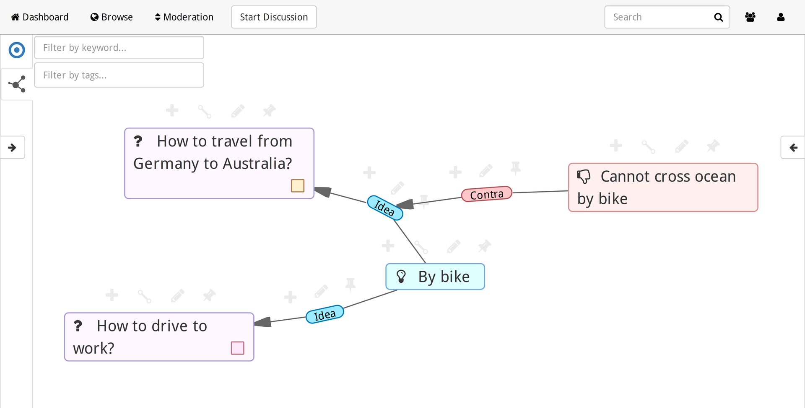
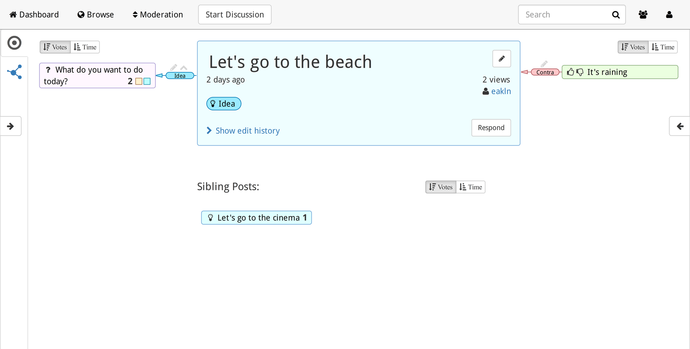

Note: We are redesigning Wust from scratch. Check out [woost/wust2](https://github.com/woost/wust2). Ideas welcome.
#Wust
A hypergraph-based discussion system

[Live demo of the prototype](http://wust.comm.rwth-aachen.de)

This is a proof of concept prototype. Please don't consider extending this project. We'd like to do a complete rewrite based on the experiences, user study results, insights and new ideas we have now. If you are interested, please contact us.

## Screenshots

## Build dependencies
- JDK 8
- simple build tool (sbt)
- Neo4j >= 2.2.2
- gem
- npm
- bower

## Build instructions
have a look into `./buildproduction` and then run it:
- `./buildproduction`
  this will run tests and build a binary containing the server with wust.

## Running
- start the neo4j server
- set the environment variables for connecting to the database:
    - `NEO4J_URL`, `NEO4J_USER`, `NEO4J_PASS`
    - to activate the tutorial: `UI_TUTORIAL_ENABLED=true`
- `./initseed` and select `[6] tasks.SeedDatabase`
    - this seeds the database
- `target/universal/stage/bin/wust`
    - starts the production web server on port `9000`

## Hacking
- `gem install compass`
- `npm install`
- `bower install`
- `npm install -g blumenkohl.js`
- start a neo4j server on `localhost:7474` with user/pw `neo4j/neo4j` or adjust using env variables `NEO4J_URL`, `NEO4J_USER`, `NEO4J_PASS`
    - don't forget to seed the database: `./initseed`
- `sbt run` and `./blumenkohl`
- open browser at http://localhost:3000
- changing source files will recompile and reload automatically

## License
wust is free software released under the [Apache License, Version 2.0][Apache]

[Apache]: http://www.apache.org/licenses/LICENSE-2.0
